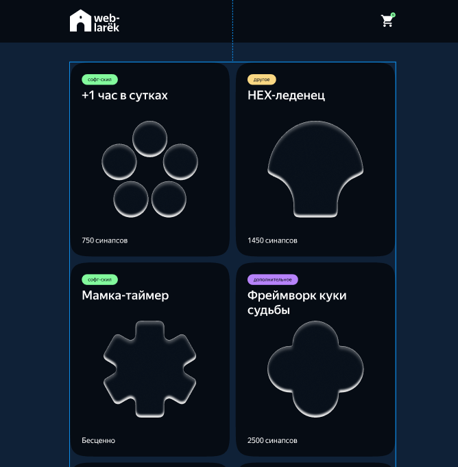

# Проектная работа "Веб-ларек"

Стек: HTML, SCSS, TS, Webpack

Структура проекта:

- src/ — исходные файлы проекта
- src/components/ — папка с JS компонентами
- src/components/base/ — папка с базовым кодом

Важные файлы:

- src/pages/index.html — HTML-файл главной страницы
- src/types/index.ts — файл с Типами
- src/index.ts — точка входа приложения
- src/styles/styles.scss — корневой файл стилей
- src/utils/constants.ts — файл с константами
- src/utils/utils.ts — файл с утилитами

## Установка и запуск

Для установки и запуска проекта необходимо выполнить команды

```
npm install
npm run start
```

или

```
yarn
yarn start
```

## Сборка

```
npm run build
```

или

```
yarn build
```

## Описание

Интернет-магазин с товарами для веб-разработчиков — Web-ларёк. В нём можно посмотреть каталог товаров, добавить товары в корзину и сделать заказ.



## Вспомогательные Типы данных

### Тип уникального Id карточки

```sh
type cardId = string;
```

### Тип котегории для раскраски

```sh
enum categoryType {
    category1 = 'софт-скил',
    category2 = 'другое',
    category3 = 'дополнительное',
    category4 = 'кнопка',
    category5 = 'хард-скилл',
}
```

### Тип для имени события или паттерн для регулярного выражения

```sh
type EventName = string | RegExp;
```

### Определение значений Типов оплаты

```sh
enum paymentType {
    online = 'Онлайн',
    offline = 'При получении',
}
```

## Интерфейсы

Интерйейс для товара

```sh
interface IProductItem {
    id: cardId;
    description: string;
    image: string;
    title: string;
    category: categoryType;
    price: number | null;
}
```

### Продуктовая модель

```sh
interface IProductModel {
    // Товары с сервиса
    items: IProductItem[];
    // Установка товаров в модель
    setItems(items: IProductItem[]): void;
    // Получение модели товаров
    getItems(): IProductItem[];
    // Получение товара по id
    getProduct(id: cardId): IProductItem;
}
```

### Модель корзины

```sh
interface IBasketModel {
    items: Map<cardId, number>;
    //Добавить товар в корзину
    add(id: cardId): void;
    //Удалить товар из корзины
    remove(id: cardId): void;
    //Очистить всю корзину
    clearAll(): void;
    //Получить текущее количсетво товаров в корзине
    getCountProducts(): number;
    //Получить текущую общую сумму корзины
    getTotal(): number;
}
```

### Интерфейс способа оплаты с выбором оплаты

```sh
interface IPayment {
    // Тип оплаты
    paymentType: paymentType[];
    // выбронный Тип оплаты
    select: boolean;
}
```

### Интерфейс для модели заказа

```sh
interface IOrderModel {
    // Тип оплаты
    payment: IPayment;
    // адрес
    adress: string;
    // очистить модель и снять выбор со способа оплаты
    clearAll(): void;
}
```

### Интерфейс для модели контактов

```sh
interface IContactModel {
    // номер Телефона
    phone: string;
    // адресс электронной почты
    email: string;
    // очистить модель и снять выбор со способа оплаты
    clearAll(): void;
}
```

### Интерйфейс для описания внутреннего состояние приложения

### и хранения моделий

```sh
interface IAppState {
    productModel: IProductModel;

    basketModel: IBasketModel;

    contactModel: IContactModel;

    orderModel: IOrderModel;

    //Модальное окно активное в данный момент
    modalOpened: HTMLElement;

    // Состояние приложения ( технический статус состояния приложения например для разграничения до и посли загрузки товаров )
    stateApp: string;
}
```

### Интерфейс для страницы

```sh
interface IPage {
    // Счетчик товаров в корзине
    counter: HTMLElement;
    // Список карточек товаров
    store: HTMLElement[];
}
```

### Интерфейс для карточки товара

```sh
interface ICard extends IProductItem { }
```

### Интерфейс окна корзины

```sh
interface IBasket {
    // Лист выбранных товаров в корзине
    list: HTMLElement[];
    // Общая сумма товаров в корзине
    total: HTMLElement;
}
```

### Интерфейс окна заказа

```sh
interface IOrder {
    // Тип оплаты
    payment: HTMLElement;
    //адрес доставки
    adress: HTMLElement;
}
```

### Интерфейс окна контактов

```sh
interface IContacts {
    // номер Телефона
    phone: HTMLElement;
    // адресс электронной почты
    email: HTMLElement;
}
```

### Интерфейс для Api взаимодействия с сервером

```sh
interface IApi {
    // Базовый Url
    baseUrl: string;

    //Get запрос сервиса
    get(uri: String): void;

    //Post запрос  на сервис
    post(uri: String, data: Object): void;

    //Обработка ответа от сервиса в виде промиса с данными
    response(response: Response): Promise<Partial<object>>;
}
```

### Интерфейс для брокера событий

```sh
interface IEvents {
    //Установить обработчик на событие
    on<T extends object>(event: EventName, callback: (data: T) => void): void;
    //Инициировать событие с данными
    emit<T extends object>(event: EventName, data?: T): void;
    //Сделать коллбек триггер, генерирующий событие при вызове
    trigger<T extends object>(
        event: EventName,
        context?: Partial<T>
    ): (data: T) => void;
}
```

### Интерфейс для модального окна

```sh
interface IModal {
    // Html элимент для модального окна
    content: HTMLElement;
    // открытие окна
    open(): void;
    // закрытие окна
    close(): void;
    // обработка закрытия по кнопке Esc
    handleEsc(): void;
}
```
